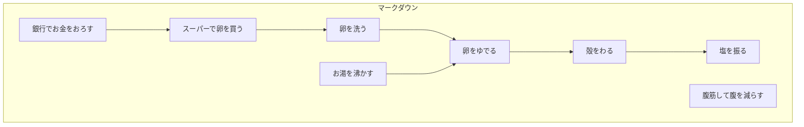

```mermaid

flowchart TB

subgraph "マークダウン"

    bank["銀行でお金をおろす"]

    super["スーパーで卵を買う"]


    wash_egg["卵を洗う"];

    boil_hotwater["お湯を沸かす"]

    boil_egg["卵をゆでる"]


    hukkin["腹筋して腹を減らす"]

    crack["殻をわる"]

    salt["塩を振る"]

end

bank--->super;
super--->wash_egg

wash_egg--->boil_egg

boil_hotwater--->boil_egg;
boil_egg--->crack;
crack--->salt;

 

```