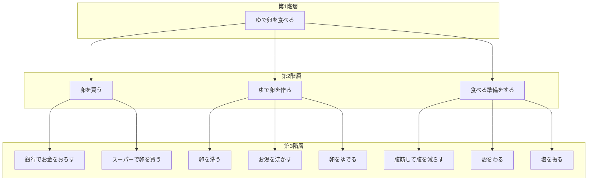

```mermaid

flowchart TB

subgraph "第1階層"

    eat_egg["ゆで卵を食べる"]

end

subgraph "第2階層"

    bay_egg["卵を買う"]

    cook_egg["ゆで卵を作る"]

    prepare_eat["食べる準備をする"]

end


subgraph "第3階層"

    bank["銀行でお金をおろす"]

    super["スーパーで卵を買う"]


    wash_egg["卵を洗う"];

    boil_hotwater["お湯を沸かす"]

    boil_egg["卵をゆでる"]


    hukkin["腹筋して腹を減らす"]

    crack["殻をわる"]

    salt["塩を振る"]

end


%% 第1階層から第2階層へ

eat_egg--->bay_egg;

eat_egg--->cook_egg;

eat_egg--->prepare_eat;


%% 第2階層から第3階層へ

bay_egg--->bank;

bay_egg--->super;


cook_egg--->wash_egg;

cook_egg--->boil_hotwater;

cook_egg--->boil_egg;


prepare_eat--->hukkin;

prepare_eat--->crack;

prepare_eat--->salt;

 

```